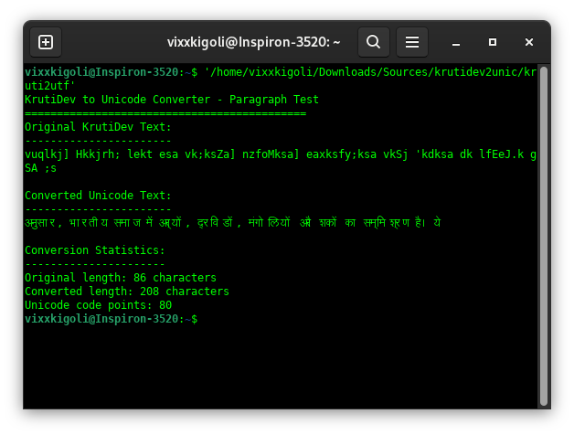

# Project Krutf: Convert KrutiDev10 to UTF-8
**Version:** 0.1
**Author:** @vixxxkigoli

## Features
- Support GNU codes for linux,can be used directly into native Linux apps.

## Screenshots 

### Dumping Firmware from Device

